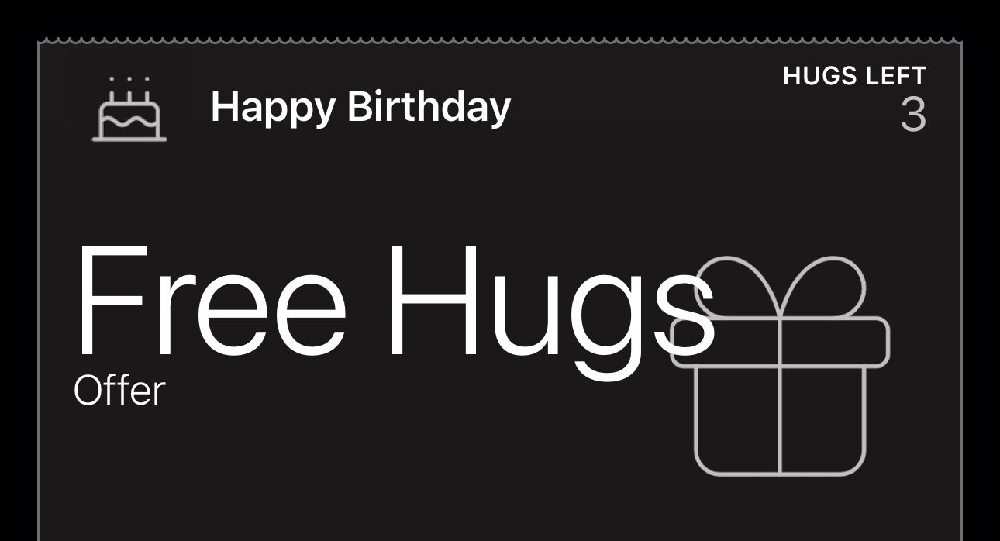

<header style="display: flex; flex-direction: row; gap: 2em; padding-bottom: 1em;">
    
    <h1>Apple Wallet Pass</h1>
</header>

This is a simple apple wallet pass coupon I made for a friend for his birthday.

    

## Goals
- Learn about Apple Wallet Passes
- Have a cool gift for my friend

## Steps to create a pass

- Create/Update/Edit the files in the `hugpass` directory
    - Update the `pass.json` file, replacing the `<REPLACE_ME>` values with your own.
    - Update the `en.lproj/pass.strings` file
    - `icon.png` : 87x87 px
    - `logo.png` : 160x150 px and 320x300 px
    - `strip.png` : 1125x432 px

- Run `genManifest.py` to generate the `manifest.json` file

- Run following command to generate signature
    - `openssl smime -binary -sign -certfile AppleWWDRCAG4.pem -signer pass.pem -inkey ALDsigning.key -in ./hugpass/manifest.json -out ./hugpass/signature -outform DER`

> Before running the above command, make sure you have the following files `AppleWWDRCAG4.pem`, `ALDsigning.key`, `pass.pem` [follow steps here](#getting-the-certificates-to-sign-the-pass-windows)

- Zip the contents of the `hugpass` directory into a `.pkpass` file

## Getting the certificates to sign the pass (Windows)

- `AppleWWDRCAG4.cer` : Apple Worldwide Developer Relations Certification Authority. This can be downloaded from Apple Developer website.
    - You can convert this to a `.pem` file using `openssl x509 -inform DER -in AppleWWDRCAG4.cer -out AppleWWDRCAG4.pem`

- Create a new certificate signing request (CSR) for the pass `openssl req -new -key ALDsigning.key -out csr3072ALDSigning.certSigningRequest -subj "/emailAddress=test@gmail.com, CN=hugpass, C=CA"`, replacing `test@gmail.com` with your email address.

- Create a Pass Type ID, in the identifier section of you Apple Developer account.
- Create certificate for the Pass Type ID. For the certificate you will need to provide the CSR file you created earlier. Once done you can download the `pass.cer` file.
- Convert the `pass.cer` file to a `.pem` file using `openssl x509 -inform DER -in pass.cer -out pass.pem`

## Backend
- There is a backend folder created which can be used for registering passes, and updating them.

## Refrence
[Wallet Passes](https://developer.apple.com/documentation/WalletPasses)

## License

Distributed under the MIT License. See `LICENSE.txt` for more information.